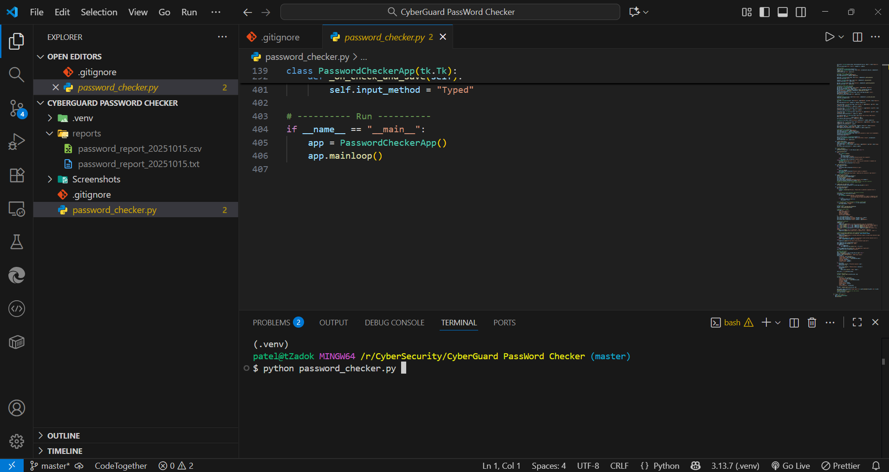
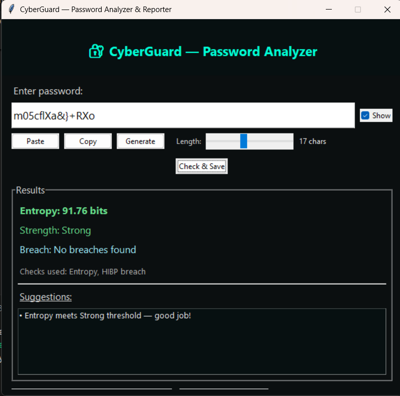
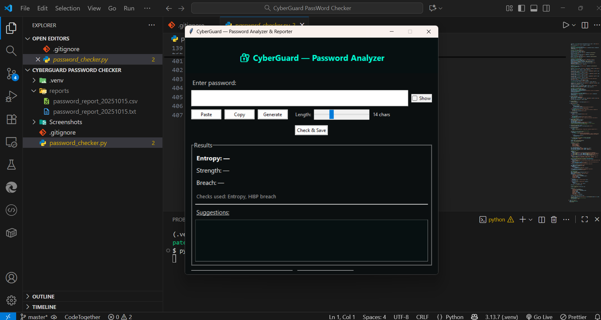
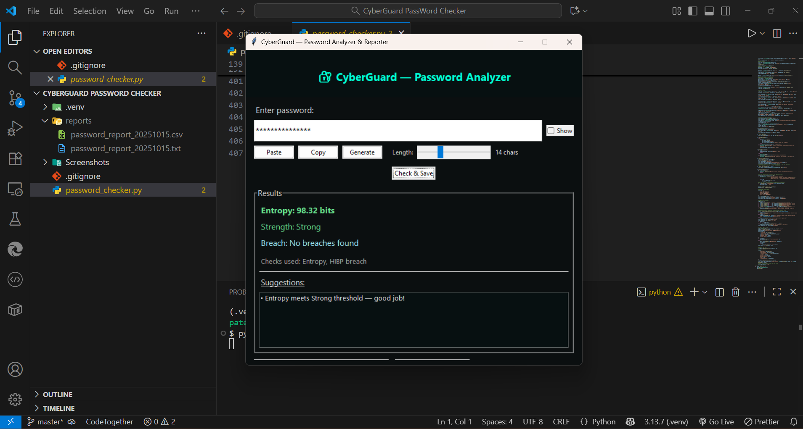
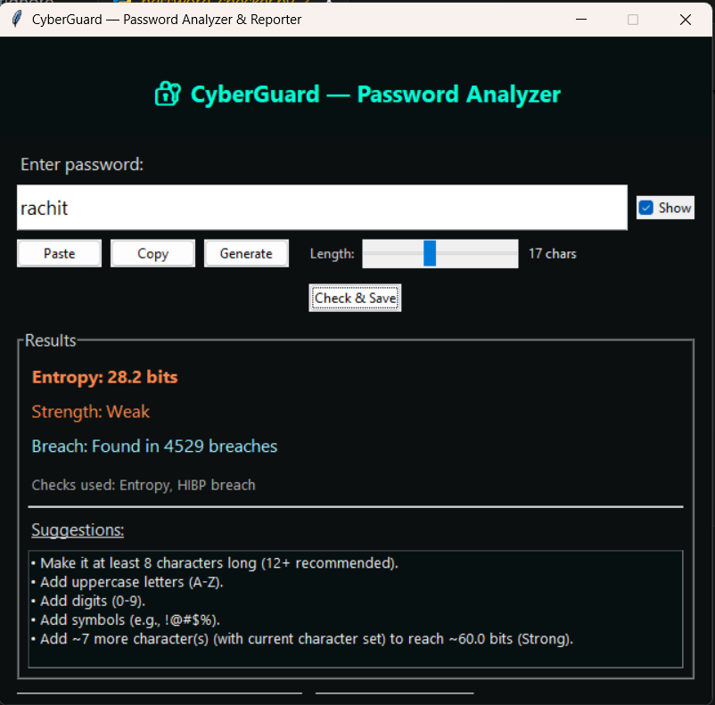

# CyberGuard — GUI Password Analyzer & Reporter


**CyberGuard** is a Python-based GUI tool for cybersecurity enthusiasts and professionals. It analyzes password strength, estimates entropy, checks for breaches using the Have I Been Pwned API, generates strong passwords, and creates detailed reports. Ideal for portfolio projects, internships, and demonstrating practical security skills.

---

## Features

- **Password Strength Analysis**: Calculates entropy and strength level (Very Weak → Very Strong)  
- **Breach Detection**: Checks if a password has been exposed using the HIBP API  
- **Password Generator**: Generate strong passwords with configurable length (6–32 characters)  
- **Show/Hide Password**: Toggle password visibility for convenience  
- **Clipboard Support**: Copy and paste passwords easily  
- **Detailed Suggestions**: Provides actionable advice to strengthen passwords  
- **Report Generation**:  
  - Generates `.txt` and `.csv` reports in `reports/` folder  
  - Includes timestamp, entropy, strength, breach result, and input method  

---

## Screenshots

### CLI Output
  
*CLI output showing the password analysis results for a sample password.*

### Generated Password
  
*Example of a strong password generated by the CyberGuard tool.*

### GUI Interface
  
*The main GUI interface of CyberGuard, showing input fields and controls.*

### Password Checker
  
*Password checking in action: shows strength, entropy, and breach check.*

### Weak Password Suggestion
  
*Weak password detected and suggestions provided to improve security.*

---

## Installation

**Requirements:**

- Python 3.8+  
- Pip packages:

```bash
pip install requests pyperclip
```

**Run the Tool :**
```python password-checker.py ```

**Usage :**
1. Enter or generate a password
2. Toggle Show Password if needed
3. Click Check & Save to analyze password and save report
4. View results: entropy, strength, breach status, suggestions
5. Reports are saved automatically under reports/

**Example Report Entry:**
Timestamp:
```bash
2025-10-15T16:40:12
Input method: Generated
Checks performed: Entropy check, HIBP breach check
Masked preview: Ab********YZ
SHA1: 4A7D1ED414474E4033AC29CCB8653D9B
Entropy: 70.12
Strength level: Strong
Breach result: No breaches found
```

## MIT License
This project is licensed under the MIT License — see the [LICENSE](LICENSE) file for details.
